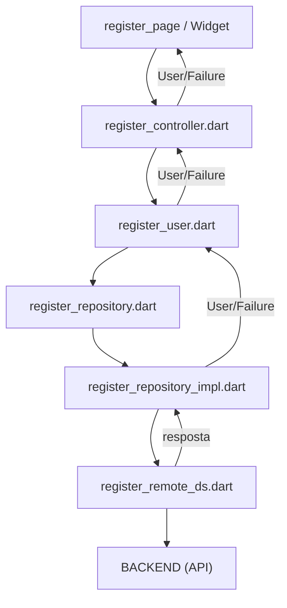

# Fluxo Clean Architecture — Cadastro de Usuário (Flutter/Dart)

Esta documentação descreve o **fluxo completo do cadastro de usuário**, seguindo Clean Architecture, para seu projeto Flutter.

---

## 1. 📦 Camadas e arquivos principais

### **DATA**

- [x] **Datasource:** `lib/features/user/data/datasources/register_remote_ds.dart`
- [x] **Model:** `lib/features/user/data/models/user_model.dart`
- [x] **Repository Impl:** `lib/features/user/data/repositories/register_repository_impl.dart`

### **DOMAIN**

- [x] **Entity:** `lib/features/user/domain/entities/user.dart`
- [x] **Repository (contrato):** `lib/features/user/domain/repositories/register_repository.dart`
- [x] **Usecase:** `lib/features/user/domain/usecases/register_user.dart`

### **APPLICATION**

- [x] **Controller:** `lib/features/user/application/register_controller.dart`

### **CORE**

- [x] **Failure:** `lib/core/errors/failure.dart`

---

## 2. 🚀 Como funciona o fluxo



---

## 3. 📂 Estrutura e papel dos arquivos

### 3.1. **[DATA] Datasource (Chamando a API)**

```dart
// lib/features/user/data/datasources/register_remote_ds.dart
class RegisterRemoteDataSource {
  final Dio dio;
  RegisterRemoteDataSource(this.dio);

  Future<Map<String, dynamic>> registerUser(String user, String password, String passwordConfirm) async {
    // Faz requisição POST para o backend
    // Retorna o JSON completo
  }
}
```

---

### 3.2. **[DATA] Model e conversão**

```dart
// lib/features/user/data/models/user_model.dart
import '../../domain/entities/user.dart';

class UserModel {
  final int id;
  UserModel({required this.id});

  factory UserModel.fromJson(Map<String, dynamic> json) => UserModel(id: json['id'] as int);

  User toEntity() => User(id: id);
}
```

---

### 3.3. **[DATA] Repository Implementation e Error Handling**

```dart
// lib/features/user/data/repositories/register_repository_impl.dart
import 'package:dartz/dartz.dart';
import '../../../../core/errors/failure.dart';
import '../../domain/entities/user.dart';
import '../../domain/repositories/register_repository.dart';
import '../models/user_model.dart';
import '../datasources/register_remote_ds.dart';

class RegisterRepositoryImpl implements RegisterRepository {
  final RegisterRemoteDataSource remote;
  RegisterRepositoryImpl(this.remote);

  @override
  Future<Either<Failure, User>> registerUser(
    String user, String password, String passwordConfirm
  ) async {
    try {
      final resp = await remote.registerUser(user, password, passwordConfirm);
      if (resp['http_code'] == 201) {
        final userModel = UserModel.fromJson(resp['data']);
        return Right(userModel.toEntity());
      } else if (resp['http_code'] == 422) {
        final val = resp['data']['validation'] as Map<String, dynamic>;
        final msg = val.values.join('\n');
        return Left(Failure(msg));
      } else {
        return Left(Failure('Erro inesperado!'));
      }
    } catch (e) {
      return Left(Failure('Erro de comunicação'));
    }
  }
}
```

---

### 3.4. **[DOMAIN] Entidade de Dominio**

```dart
// lib/features/user/domain/entities/user.dart
class User {
  final int id;
  User({required this.id});
}
```

---

### 3.5. **[DOMAIN] Contrato do Repositório**

```dart
// lib/features/user/domain/repositories/register_repository.dart
import 'package:dartz/dartz.dart';
import '../../../../core/errors/failure.dart';
import '../entities/user.dart';

abstract class RegisterRepository {
  Future<Either<Failure, User>> registerUser(
    String user, String password, String passwordConfirm
  );
}
```

---

### 3.6. **[DOMAIN] Caso de Uso — UseCase**

```dart
// lib/features/user/domain/usecases/register_user.dart
import 'package:dartz/dartz.dart';
import '../../../core/errors/failure.dart';
import '../entities/user.dart';
import '../repositories/register_repository.dart';

class RegisterUser {
  final RegisterRepository repository;
  RegisterUser(this.repository);

  Future<Either<Failure, User>> call(
    String user, String password, String passwordConfirm
  ) {
    return repository.registerUser(user, password, passwordConfirm);
  }
}
```

---

### 3.7. **[APPLICATION] Controller**

```dart
// lib/features/user/application/register_controller.dart
import '../domain/usecases/register_user.dart';

class RegisterController {
  final RegisterUser registerUserUseCase;
  RegisterController(this.registerUserUseCase);

  Future<String?> registrar(String usuario, String senha, String confirmarSenha) async {
    final result = await registerUserUseCase(usuario, senha, confirmarSenha);
    return result.fold(
      (failure) => failure.message,
      (user) => null, // Sucesso, pode customizar retorno
    );
  }
}
```

---

### 3.8. **[CORE] Classe Failure**

```dart
// lib/core/errors/failure.dart
class Failure {
  final String message;
  Failure(this.message);
}
```

---

## 4. 🎯 Fluxo final na UI (Widget/page)

```dart
final controller = RegisterController(RegisterUser(RegisterRepositoryImpl(remoteDataSource)));

// Ao clicar no botão "Registrar"
final erro = await controller.registrar('username', 'senha123', 'senha123');
if (erro == null) {
  // Sucesso: mostre feedback positivo ao usuário
} else {
  // Erro: exiba mensagem na tela
}
```

---

## 5. ✅ Vantagens desse fluxo

- **Nenhuma camada da UI ou controller acessa DTO/API diretamente**
- **Todos erros tratados via Failure e mensagens legíveis**
- **Arquitetura já pronta para crescer, testar e desacoplar**
- **Fácil evolução: mudou backend/model? Só adapta o Model e o Repo**

---

_Qualquer dúvida, basta perguntar!_
